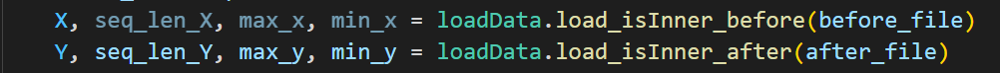
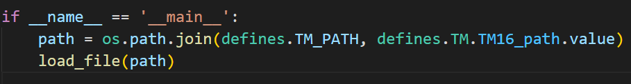
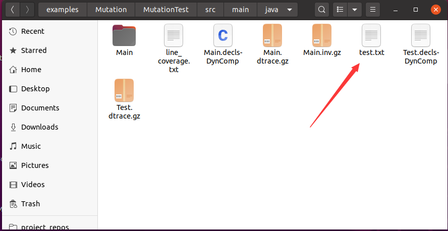
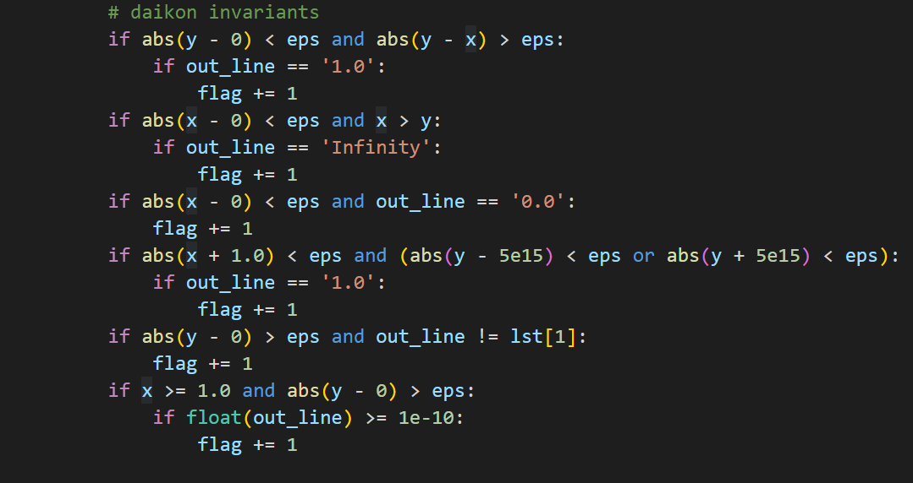
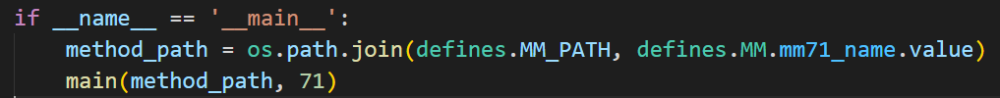

# Table of Contents
- [Introduction](#introduction) 
- [Structure](#structure)
- [SourceCode Description](#sourcecode-description-code)
- [Operating Instruction](#operating-instruction)
    - [Test case generation](#test-case-generation)
    - [Environmental requirements](#environmental-requirements)
    - [OneMoreTest](#oneMoreTest)
    - [Random-based selection](#random-based-selection)
    - [Coverage-based selection](#coverage-based-selection)
    - [Daikon-based selection](#daikon-based-selection)
- [Table](#table)
# Introduction
This is the replication package of the paper "One More Test: A Novel Approach to Generating and Selecting Fault-Revealing Unit Tests". It is composed of tools (including the proposed approach and baseline approaches) and data employed in the evaluation.

# Structure
- Code: source code of the experiment
- Data: TrainingData & TestingData of experiment
- Data/OneMoreTest: The experimental data of OneMoreTest
- Data/Random: The experimental data of random-based selection
- Data/Coverage: The experimental data of coverage-based selection
- Data/Daikon: The experimental data of daikon-based selection
- Gif: Instructions for generating test cases

# SourceCode Description (/Code)
- train.py: code file for training the neural network
- test.py: code file for testing the neural network & Test case prioritization
- loadData.py: Loading and processing data
- defines.py: code file for defining the file path
- Coverage.py: main file for coverage-based selection
- daikon.py: main file for daikon-based selection
- DataGenerator.jar: Jar package for random generation of test cases
- GenerateTestCases: IDEA plug-in project that randomly generates test cases

# Operating Instruction
## Test case generation
- Download DataGenerator.jar,TestOracle project
- Run GenerateTestCases as IDEA plug-in project
- Import the DataGenerator.jar into the project under test
- Select the method under test(MUT)
- Click the ***Extract Variables*** button
- Click the ***Generate Data*** button
- Select the inputs and outputs to generate
- Click the ***Confirm*** button
- Manually set ranges for inputs based on data type
- Click the ***Generate*** button
- Then you will see the ***before_data.txt*** and ***after_data.txt*** under the project folder


## Environmental requirements
- jdk1.8/jdk11
- python3.6
- daikon

- Daikon (only for daikon-based selection)
    - Download daikon from [Daikon](http://plse.cs.washington.edu/daikon/download/)
    - Install Daikon environment according to the [Daikon Documentation](http://plse.cs.washington.edu/daikon/download/doc/daikon.html#Installing-Daikon)
    - Compile the target java files: run ```javac -g RootPath/*.java```
    - Run DynComp: ```java -cp .:$DAIKONDIR/daikon.jar daikon.Chicory --daikon --comparability-file=ClassName.decls-DynComp PackageName.ClassName```
    - Run Chicory: ```java -cp .:$DAIKONDIR/daikon.jar daikon.Chicory --comparability-file=ClassName.decls-DynComp PackageName.ClassName```
    - Run Daikon: ```java -cp $DAIKONDIR/daikon.jar daikon.Daikon ClassName.dtrace.gz > daikon.txt```

## OneMoreTest
- Generate Test cases
    - before_data.txt: the input of test cases
    - after_data.txt: the output of test cases
    - label.txt: the label of test cases (only for testing)


- Select the corresponding data processing function: ``` loadData.load_isInner_before(before_file)```


- Run ```python main.py```

## Random-based selection
- Load the corresponding data as dataset.(input,output,label)


- execute ```random.shuffle(dataset)```


- Run ```python count_label.py```

## Coverage-based selection
- Select the corresponding test case and line coverage file path (```load_file(compare_path)```)


- Run ```python Coverage.py```

## Daikon-based selection
- Run Daikon on MUT and get Daikon output information


- Generate the sorting algorithm base on the output of daikon


- Select the corresponding sorting algorithm of MUT: ```main(method_path, 71)```


- Run ```python daikon.py```

## Table
|   ID   |      Method Signature     |  Size(LOC)   | # Invoked Methods  |
|:------:|:----------------------------:|:-------:|:-------:|
|   M1   | JsonPointer compile(String) | 26  | 5 |
|   M2   | int read(byte[],int,int) | 24  | 1 |
|   M3   | void print(Object) | 14  | 6 |
|   M4   | void addYears(int) | 5  | 4 |
|   M5   | void addMonths(int) | 5  | 4 |
|   M6   | void addWeeks(int) | 5  | 4 |
|   M7   | void addDays(int) | 5  | 4 |
|   M8   | void add(DurationFieldType, int) | 5  | 4 |
|   M9   | MonthDay minusMonths(int) | 9  | 6 |
|   M10   | MonthDay plusMonths(int) | 9  | 6 |
|   M11   | boolean isSameLocalTime(Calendar, Calendar) | 13  | 1 |
|   M12   | int read(byte[], int, int) | 14  | 3 |
|   M13   | long getTimeout() | 7  | 1 |
|   M14   | boolean equals(Object) | 3  | 1 |
|   M15   | long readBits(int) | 30  | 1 |
|   M16   | TarArchiveEntry getNextTarEntry() | 74  | 13 |
|   M17   | long skip(long) | 21  | 2 |
|   M18   | Date getSet() | 3  | 1 |
|   M19   | Date getRise() | 3  | 1 |
|   M20   | float round(float, int, int) | 5  | 3 |
|   M21   | double gamma(final double) | 62  | 5 |
|   M22   | &lt;T&gt; T fromJson(String, Class&lt;T&gt;) | 3  | 2 |
|   M23   | FloatWritable evaluate(final Float, <br/>final Float, final Float) | 12  | 1 |
|   M24   | print(Mode mode, String, String, String) | 28  | 3 |
|   M25   | _findSecondary(int, int, int[], int) | 23  | 2 |
|   M26   | boolean isCachable() | 6  | 1 |
|   M27   | &lt;T&gt; T readValue(String) | 8  | 2 |
|   M28   | &lt;T extends JsonNode&gt; T valueToTree (Object) | 15  | 3 |
|   M29   | void writeFieldName(String) | 4  | 2 |
|   M30   | JsonToken nextToken() | 133  | 21 |
|   M31   | String convertToString() | 31  | 3 |
|   M32   | decodeEncodedWords(String, <br/>DecodeMonitor, Charset) | 35  | 7 |
|   M33   | String encodeEncodedWord(String, Usage, <br/>int, Charset, Encoding) | 23  | 5 |
|   M34   | Fraction multiply(final int) | 3  | 1 |
|   M35   | double cumulativeProbability(double) | 6  | 2 |
|   M36   | String soundex(String) | 23  | 1 |
|   M37   | Token nextToken(Token) | 52  | 11 |
|   M38   | String normalize(String) | 3  | 3 |
|   M39   | JsonToken nextToken() | 131  | 18 |
|   M40   | encode(final Map &lt;String, String&gt;, <br/>final boolean, final String) | 20  | 5 |
|   M41   | String sanitize(String) | 26  | 2 |
|   M42   | int anyInt() | 3  | 2 |
|   M43   | boolean equals(Object) | 8  | 1 |
|   M44   | double pow(double, double) | 122  | 1 |
|   M45   | &lt;T&gt; T readValue(String, Class &lt;T&gt;) | 27  | 6 |
|   M46   | int getPrefixLength(String) | 52  | 2 |
|   M47   | round(double, int, int) | 14  | 4 |
|   M48   | boolean containsWord(String, String) | 8  | 3 |
|   M49   | URL[] toURLs(File[]) | 8  | 1 |
|   M50   | _deserialize(String, DeserializationContext) | 70  | 12 |
|   M51   | String encodeEncodedWord(String, Usage,<br/>int, Charset, Encoding) | 22  | 5 |
|   M52   | String doubleMetaphone(String) | 104  | 22 |
|   M53   | boolean equals(Object) | 16  | 3 |
|   M54   | boolean wildcardMatch (String, String) | 77  | 7 |
