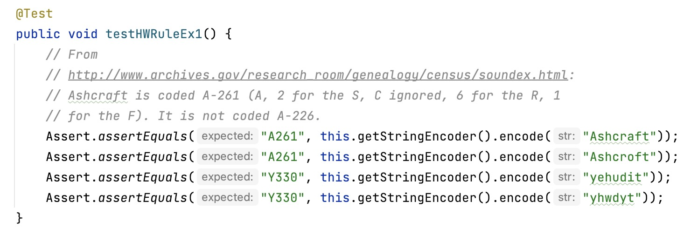
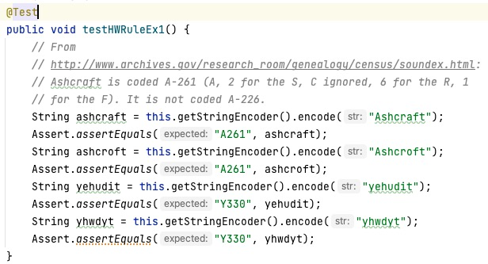
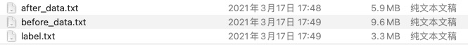
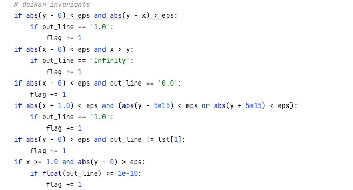

# Table of Contents
- [Introduction](#introduction) 
- [Structure](#structure)
- [Environmental requirements](#environmental-requirements)
- [Operating Instruction](#operating-instruction)
    - [Test case generation](#test-case-generation)
    - [Execution of OneMoreTest](#execution-of-oneMoreTest)
    - [Random-based selection](#random-based-selection)
    - [Coverage-based selection](#coverage-based-selection)
    - [Daikon-based selection](#daikon-based-selection)
# Introduction
This is the replication package of the paper "One More Test: A Novel Approach to Generating and Selecting Fault-Revealing Unit Tests". It is composed of tools (including the proposed approach and baseline approaches) and data employed in the evaluation.

# Structure
- Tools: source code of the experiment
- Data: TrainingData & TestingData of experiment
- Fig: Instructions

# Environmental requirements
- jdk1.8/jdk11
- python3.6
- daikon

- Daikon (only for daikon-based selection)
    - Download daikon from [Daikon](http://plse.cs.washington.edu/daikon/download/)
    - Install Daikon environment according to the [Daikon Documentation](http://plse.cs.washington.edu/daikon/download/doc/daikon.html#Installing-Daikon)
    - Compile the target java files: run ```javac -g RootPath/*.java```
    - Run DynComp: ```java -cp .:$DAIKONDIR/daikon.jar daikon.Chicory --daikon --comparability-file=ClassName.decls-DynComp PackageName.ClassName```
    - Run Chicory: ```java -cp .:$DAIKONDIR/daikon.jar daikon.Chicory --comparability-file=ClassName.decls-DynComp PackageName.ClassName```
    - Run Daikon: ```java -cp $DAIKONDIR/daikon.jar daikon.Daikon ClassName.dtrace.gz > daikon.txt```

# Operating Instruction
## 1. Test case generation
- (1) Download DataGenerator.jar, GenerateTestCases project
- (2) Run GenerateTestCases as IDEA plug-in project
- (3) Import the DataGenerator.jar into the project under test
- (4) Select the method under test(MUT)
- (5) Mutate the tests
    - For example, the testing code of MUT before mutation is as follows.
    - After mutation, the actual output of the MUT is extracted as a variable.
- (6) Click the ***Generate Data*** button
- (7) Select the inputs and outputs to generate
- (8) Click the ***Confirm*** button
- (9) Manually set ranges for inputs based on data type
- (10) Click the ***Generate*** button
- Then you will see the ***before_data.txt*** and ***after_data.txt*** under the project folder

## 2. Execution of OneMoreTest
- Generate Test cases
    - before_data.txt: the input of test cases
    - after_data.txt: the output of test cases
    - label.txt: the label of test cases (only for testing)


- Select the corresponding data processing function: 
```python
    X, seq_len_X, max_x, min_x = loadData.before_func.get(name)(before_file)
    Y, seq_len_Y, max_y, min_y = loadData.after_func.get(name)(after_file)
```
-  Then excute the following commands:
-  ```python train.py```
-  ```python test.py```

## 3. Random-based selection
- Load the corresponding data as dataset.
```python
    file_path = os.path.join(path, 'label.txt')
```
- Execute ```python randomSelection.py```

## 4. Coverage-based selection
- Run the corresponding tests, and use the coverage recording tool to record the number of lines of MUT covered by each test.
- Select the line coverage file path.
- Execute ```python Coverage.py```

## 5. Daikon-based selection
- Run Daikon on MUT and get Daikon output information.

- Generate the sorting algorithm base on the output of daikon.


- Select the corresponding sorting algorithm of MUT.

- Execute ```python daikon.py```

